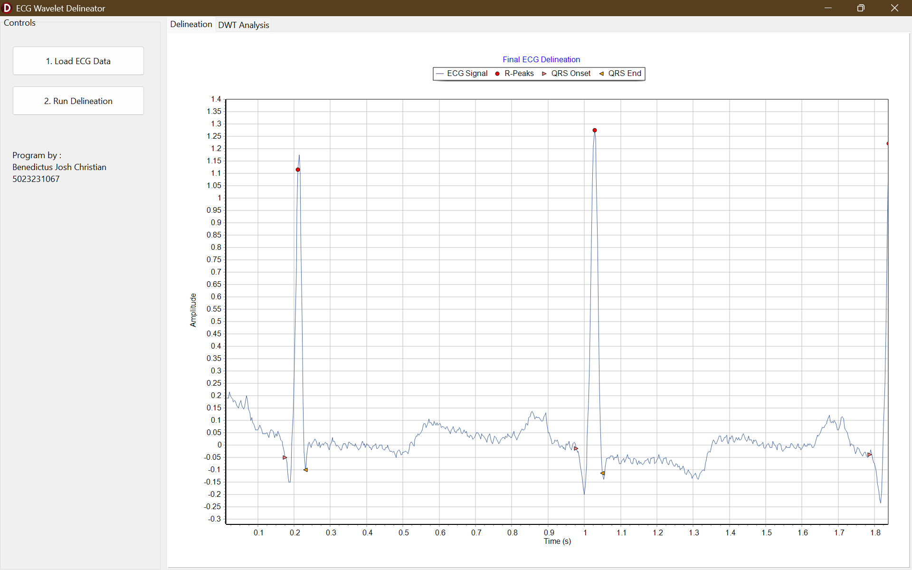
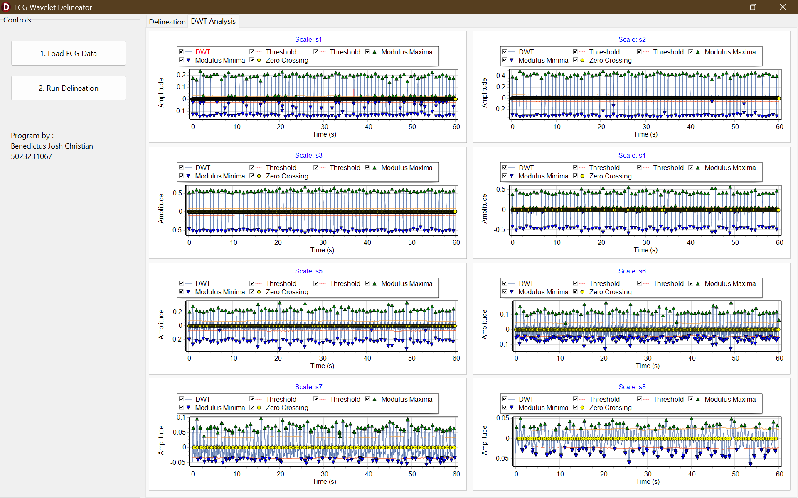

# ecg-delineation-wavelet
An ECG signal processing application for QRS complex delineation using Discrete Wavelet Transform (DWT) method, implemented in Delphi with the VCL framework.

## Key Features

-   **ECG Data Loading:** Loads time-series ECG data from standard `.txt` or `.dat` files.
-   **Signal Pre-processing:** Centers the signal by removing the DC offset (mean).
-   **Multi-Scale Wavelet Transform:** Applies a DWT across 8 predefined scales ($2^1$ to $2^8$) to decompose the ECG signal. The wavelet coefficients are derived from the first derivative of a quadratic spline function.
-   **Robust R-Peak Detection:** Implements a multi-scale algorithm that identifies R-peak candidates by analyzing modulus maxima and adaptive, RMS-based thresholds across scales `s1` through `s4`. Zero-crossings at the finest scale (`s1`) are used to precisely locate the R-peak.
-   **QRS Complex Delineation:** After R-peak detection, the algorithm analyzes the wavelet transform at scale `s2` to accurately determine the **QRS onset** (start) and **QRS offset** (end) points for each heartbeat.
-   **Comprehensive Visualization:** The user interface, built with VCL, features:
    -   A primary chart showing the original ECG with the delineated R-peaks, QRS onsets, and QRS offsets clearly marked.
    -   A separate tabbed view with 8 charts, each dedicated to a different wavelet scale, displaying the transformed signal, adaptive thresholds, detected modulus maxima/minima, and zero-crossings.

---

## Technical Implementation

-   **Language:** **Delphi (Object Pascal)**
-   **Framework:** **VCL (Visual Component Library)** for the graphical user interface.
-   **Core Algorithm:**
    1.  **Convolution:** The DWT is implemented as a direct convolution between the input ECG signal and the pre-calculated, normalized wavelet filter coefficients for each scale.
    2.  **Adaptive Thresholding:** Dynamic thresholds are calculated using the Root Mean Square (RMS) of the wavelet-transformed signal over a moving window.
    3.  **Peak Validation:** R-peaks are found by confirming significant events across multiple scales. QRS boundaries are then determined by searching for local minima and threshold crossings in the wavelet domain around each R-peak.
-   **Data Structures:** Utilizes generic `TDictionary` collections for managing filter and wavelet data, and dynamic arrays (`TDoubleArray`, `TIntegerArray`) for efficient signal manipulation.

---

## How to Use

1.  Launch the application.
2.  Click the **"Load ECG Data"** button and select a compatible `.txt` or `.dat` file.
3.  Once the data is loaded and displayed, click the **"Delineate ECG"** button to run the analysis.
4.  View the final delineated points on the main chart in the "Final Delineation" tab.
5.  Explore the "Wavelet Scales" tab to see the detailed analysis for each of the 8 wavelet scales.

---

## Screenshots & Examples

Here are some examples of the application's user interface and the final delineation output.

### Main Application Window
*The main view after loading an ECG signal and running the delineation process. The final R-peaks, QRS onsets, and offsets are clearly marked on the original signal.*

---

### Wavelet Scale Analysis
*A view of the wavelet transform across 8 predefined scales ($2^1$ to $2^8$). The charts shows the transformed signal, the adaptive RMS threshold, and the detected modulus maxima used for analysis.*

